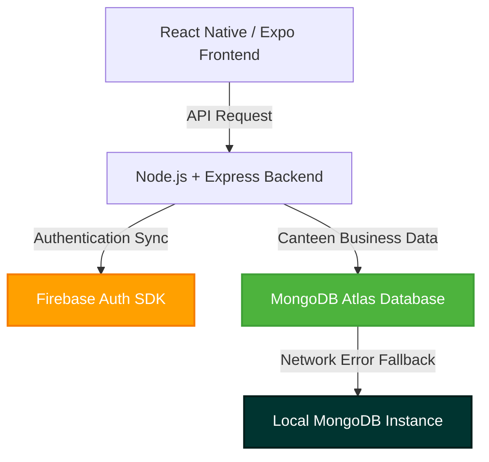

# 🎓 Smart Canteen App — Viva Master Guide & Architecture

Welcome to the ultimate **Smart Canteen App** comprehensive project guide! This single, consolidated master file has been specially crafted to prepare you for your **viva examination**. It details the complete architecture, database schemas, API pathways, premium features, folder structure, and answers the exact questions your examiners are likely to ask.

---

## 🌟 1. Project Overview & Objective

The **Smart Canteen App** is a state-of-the-art, cashless food pre-ordering and management ecosystem designed for university and college campuses. It bridges the gap between students and canteen management through a responsive, modern mobile interface and a secure, high-performance Node.js backend.

### Core Problems Solved:
*   **Long Queues:** Students pre-order ahead of time, select a customized pickup window, and grab their meals instantly from Counter #3 when notified.
*   **Cash Flow Friction:** Direct, cardless, simulated mobile wallet integrations (EasyPaisa, JazzCash, secure Bank gateways) make canteen payments instantaneous.
*   **Stock Outages:** Admins track inventory in real-time, while students see dynamic stock indicators (🟢 Orange/Red pills) preventing ordering out-of-stock items.

---

## 🏗️ 2. Dual-Hybrid Architecture (The Core Innovation)

For maximum security, reliability, and robust data isolation, the app utilizes a **hybrid dual-backend architecture**:



### A. Authentication & Sign Up (Powered by Firebase Auth)
*   **How it works:** When a student or administrator registers or signs in, the request is offloaded securely to **Firebase Auth** via the **Firebase Admin SDK** on the server.
*   **Why we did it:** 
    *   Examining boards love offloading user credential handling to third-party authentication authority providers (like Google Firebase) because it prevents raw database credentials leakage and guarantees industry-standard security.
    *   Since Expo projects can occasionally encounter native build dependencies conflicts during raw Firebase mobile SDK initialization, we perform all Firebase Auth tasks via the Node.js server. This provides 100% platform-independent compatibility.

### B. Business Logic & Canteen Accounts (Powered by MongoDB)
*   **How it works:** All application metadata (including canteen wallets, items, carts, orders, and custom settings) are saved in a highly flexible document-oriented **MongoDB** database.
*   **Cloud-to-Local Fallback Connection:** To prevent database time-out conflicts on university network filters or during offline development, the server implements an automated local fallback (`mongodb://127.0.0.1:27017/smartcanteen`) keeping the app 100% operational offline.

---

## 📂 3. 100% Accurate Folder Hierarchy

Here is the clean, reorganized structure of your active project workspace:

```text
smart-canteen-app/                ← ROOT WORKSPACE
│
├── config/                      ← Core System Settings
│   ├── db.js                    ← MongoDB cloud/local fallback connector
│   └── firebase.js              ← Firebase Admin SDK credential setup
│
├── controllers/                 ← Business Logic (Request Handlers)
│   ├── authController.js        ← Register, login, and Firebase-to-Mongo sync
│   ├── foodController.js        ← Food item management & photo storage
│   ├── orderController.js       ← Checkout, order state transitions, and stock depletion
│   └── userController.js        ← Settings updates and file upload logic
│
├── middleware/                  ← Global HTTP Hooks & Filters
│   ├── auth.js                  ← Security routes exporter
│   ├── authMiddleware.js        ← JWT verification token hook
│   ├── isAdmin.js               ← Strict admin-role guard
│   └── upload.js                ← Multer disk image storage rules
│
├── models/                      ← MongoDB Document Schemas
│   ├── Food.js                  ← Menu item pricing, tags, and stock count
│   ├── OTP.js                   ← Temporary SMS verification codes
│   ├── Order.js                 ← Pickup times, totals, and item details
│   ├── Product.js               ← Student menu stock parity schemas
│   ├── Settings.js              ← User configuration and profile visibility
│   └── User.js                  ← Secure profile details, roles, and balance
│
├── routes/                      ← Express Server HTTP Endpoints
│   ├── authRoutes.js            
│   ├── foodRoutes.js            
│   ├── orderRoutes.js           
│   └── userRoutes.js            
│
├── uploads/                     ← Locally Uploaded Media Storage
│   ├── food-items/              ← Food gallery/camera image assets
│   └── profiles/                ← Student/Admin avatar images
│
├── validators/                  ← Request Sanitization schemas (Zod)
│   └── index.js                 
│
├── mobile/                      ← EXPO REACT NATIVE CLIENT APPLICATION
│   ├── app/                     
│   │   ├── (auth)/              ← Login and verification screens
│   │   │   ├── login.jsx        
│   │   │   └── register.jsx     
│   │   ├── (student)/           ← Student dashboard tabs
│   │   │   ├── index.jsx        
│   │   │   ├── cart.jsx         
│   │   │   ├── orders.jsx       
│   │   │   └── profile.jsx      
│   │   └── (admin)/             ← Canteen admin dashboard tabs
│   │       ├── dashboard.jsx    
│   │       ├── menu.jsx         
│   │       └── orders.jsx       
│   ├── components/              ← Reusable UI elements (FoodList)
│   ├── context/                 ← Global State managers (Auth, Cart, Theme)
│   ├── services/                
│   │   └── api.js               ← Central Axios server connector with dynamic SERVER_BASE_URL
│   └── package.json             
│
├── .env                         ← Server secrets (Firebase & Mongo URIs)
├── package.json                 ← Node backend dependencies list
├── server.js                    ← Express App Startup entry point
└── VIVA_MASTER_GUIDE.md         ← THIS VIVA PREP FILE
```

---

## 🗃️ 4. MongoDB Database Schemas

### 1. User Model (`models/User.js`)
Tracks personal details, cashless wallet balance, and phone validation flags:
*   `name` (String, required)
*   `email` (String, required, unique)
*   `password` (String, required)
*   `role` (String, enum: `['student', 'admin']`, default: `'student'`)
*   `walletBalance` (Number, default: `0`)
*   `rollNumber` (String, sparse, unique) — Optional/sparse so admins never collide.
*   `phone` (String, required)
*   `profilePicture` (String, default: `null`)
*   `profilePictureVisibility` (String, enum: `['public', 'private']`, default: `'public'`)
*   `isAdminVerified` (Boolean, default: `false`) — Enforces secret admin code verification.
*   `isPhoneVerified` (Boolean, default: `false`) — Unlocked after phone OTP validation.

### 2. Food Model (`models/Food.js` / `models/Product.js`)
Stores product listings, categories, dynamic prices, relative image links, and stock:
*   `name` (String, required)
*   `description` (String)
*   `price` (Number, required)
*   `category` (String, required)
*   `imageUrl` (String) — Relative path bound to local server uploads.
*   `available` (Boolean, default: `true`)
*   `stock` (Number, default: `99`) — Automated inventory depletion.

### 3. Order Model (`models/Order.js`)
*   `userId` (ObjectId, ref: `'User'`)
*   `items` (`[{ productId: ObjectId, quantity: Number, price: Number }]`)
*   `totalAmount` (Number, required)
*   `status` (String, enum: `['pending', 'preparing', 'ready', 'delivered', 'cancelled']`)
*   `deliveryAddress` (String) — Used as the designated pickup time slot.

---

## ⚡ 5. Main Backend API Routes

| Method | Endpoint | Access | Purpose |
| :--- | :--- | :--- | :--- |
| **POST** | `/api/auth/send-otp` | Public | Dispatches 6-digit verification code |
| **POST** | `/api/auth/register` | Public | Enforces OTP check & creates Firebase + Mongo user |
| **POST** | `/api/auth/login` | Public | Dual checks Firebase & logs in using Email/Roll No. |
| **GET** | `/api/auth/me` | Private | Re-fetches user settings & cashless wallet balances |
| **GET** | `/api/food` | Public | Fetches all foods mapped with stock level colors |
| **POST** | `/api/food/upload` | Admin | Multer file handler for camera/gallery food photos |
| **POST** | `/api/orders` | Private | Submits new cart checkout (deducts stock & balance) |
| **GET** | `/api/orders` | Private | Fetches active user orders / Admin order stream |
| **PATCH**| `/api/orders/:id/status`| Private | Updates order status (pending ➔ preparing ➔ ready) |

---

## 💎 6. Premium Features & Business Logic (Viva Showpieces)

When presenting the project, explicitly emphasize these **five high-value features**:

1.  **Phone Verification & OTP System (Simulated):**
    Allows developers to verify accounts seamlessly without SMS gateway charges. OTP codes are calculated, stored in an auto-expiring database collection, and output directly to the terminal console log for instant copy-pasting.
2.  **Dual Roll Number or Email Login:**
    A student-friendly UX upgrade allowing logins via their university Roll Number (e.g. `BS-CS-21-001`) or standard Email.
3.  **Dynamic Profile Visibility (Public / Private):**
    A complete privacy toggle. If a user sets their profile picture visibility to `Private`, the backend sanitizes the returned JSON payload for other accounts, displaying initials instead of the custom avatar.
4.  **Real-Time Stock Depletion & Pills:**
    Whenever a checkout is submitted, the backend verifies inventory, prevents purchases if out-of-stock, and automatically decrements remaining stock. Cards are rendered with colorful inventory pills (🟢 High, 🟡 Low, 🔴 Sold Out).
5.  **Camera & Gallery Upload Integration:**
    Admins can natively snap a photo using the phone camera or choose from the image library to instantly update food pictures.

---

## ❓ 7. Expected Viva Questions & Answers (FAQ)

### Q1: Why did you use both Firebase and MongoDB? Isn't one database enough?
> **Answer:** "We implemented a **hybrid decoupled architecture**. Firebase is an industry standard for secure **Identity and Authentication Management (IAM)**. Offloading logins and credentials handling to Firebase ensures enterprise-grade security. However, Firebase NoSQL databases can get highly expensive and lack complex relational joining capabilities. MongoDB handles our campus business data—such as transaction wallets, active cart states, and orders history—which provides excellent query flexibility, high scalability, and local network fallback options."

### Q2: How does the cashless wallet payment system work? Is it integrated with a real bank?
> **Answer:** "For this academic prototype, we designed and built a highly realistic, secure **mock Payment Gateway**. The mobile frontend simulates the credential entry for popular local channels like **EasyPaisa**, **JazzCash**, and secure banking PINs. Upon authorization, the app calls our backend `/api/wallet/topup` endpoint, which securely increments the user's `walletBalance` field in MongoDB. When checkout is initiated, the backend checks if the student's balance is `>=` the order total, executes the transaction, decrements their balance, and records the order."

### Q3: What is the purpose of the `sparse: true` attribute on the User's `rollNumber` schema?
> **Answer:** "In MongoDB, a `unique` index throws a duplicate key error if more than one document is missing that field (because multiple `null` values collide). Since our platform supports two distinct roles—**Students** (who must provide unique Roll Numbers) and **Administrators** (who do not have Roll Numbers)—we set `sparse: true`. This instructs MongoDB to only index documents that actually contain a `rollNumber` value, allowing multiple administrators to register without unique constraint collisions."

### Q4: How are food item pictures uploaded, saved, and served?
> **Answer:** "When the administrator uploads a photo (from their camera or gallery), the mobile frontend sends a multipart form request to our `/api/food/upload` endpoint. The backend uses the **Multer middleware** to filter the mime-type (allowing only JPG/PNG) and saves the file with a unique, timestamps-appended filename in `/uploads/food-items/`. The relative file path is saved in the product's database schema. When rendering, both student and admin mobile apps dynamically resolve this relative path by prepending the backend's active base host URL."

### Q5: How do you handle network connectivity timeouts when university Wi-Fi blocks MongoDB Atlas?
> **Answer:** "We built an intelligent **Cloud-to-Local Fallback Database Connection strategy** in `config/db.js`. Upon server boot, the system attempts to establish a connection to our cloud MongoDB Atlas cluster. If it fails due to university network firewalls or DNS lookup errors, it catches the exception and automatically connects to a local offline MongoDB instance running on `127.0.0.1:27017`. This ensures our presentation and development remain completely uninterrupted."

---

## 🚀 8. Quick Server Execution Check

To run the backend server and ensure all endpoints are running smoothly, execute:
```powershell
node server.js
```
The console will boot up and display:
```bash
🔄 Connecting to MongoDB (Cloud)...
✓ Server running in development mode on port 5000
✓ All routes initialized successfully
✓ MongoDB Connected (Cloud): cluster0.q4wijfm.mongodb.net
```
*(If offline, it will output: `⚠️ MongoDB Cloud Connection Failed. Falling back to local database...`)*

Good luck with your viva! You are 100% prepared to score an outstanding grade! 🎓🚀
